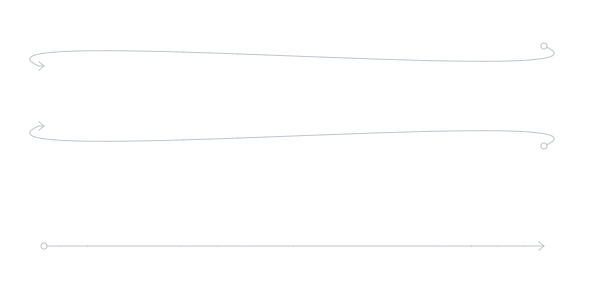
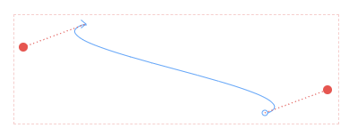

# react-absolute-svg-arrows

React implementation of SVG arrows with using absolute positioning.





Detailed implementation of these arrows is described in following article series:
https://medium.com/productboard-engineering/how-we-implemented-svg-arrows-in-react-the-basics-1-3-e469ce070e00


## Install
```bash
yarn add react-absolute-svg-arrows
```

## Demo
https://codesandbox.io/s/react-absolute-svg-arrows-jrzvb

## Basic use

```jsx

import { Arrow } from 'react-absolute-svg-arrows';

const startPoint = {
  x: 100,
  y: 100,
};
const endPoint = {
  x: 600,
  y: 300,
};


function App() {
  return (
    <Arrow 
      startPoint={startPoint} 
      endPoint={endPoint} 
    />
  )
}
```

## Configuration

```typescript
export type Point = {
  x: number;
  y: number;
};

type ArrowConfig = {
  arrowColor?: string;
  arrowHighlightedColor?: string;
  controlPointsColor?: string;
  boundingBoxColor?: string;
  dotEndingBackground?: string;
  dotEndingRadius?: number;
  arrowHeadEndingSize?: number;
  hoverableLineWidth?: number;
  strokeWidth?: number;
};

type ArrowProps = {
  startPoint: Point;
  endPoint: Point;
  isHighlighted?: boolean;
  showDebugGuideLines?: boolean;
  onMouseEnter?: (e: React.MouseEvent) => void;
  onMouseLeave?: (e: React.MouseEvent) => void;
  onClick?: (e: React.MouseEvent) => void;
  config?: ArrowConfig;
  tooltip?: string;
};
```

## Storybook
```bash
yarn storybook
```